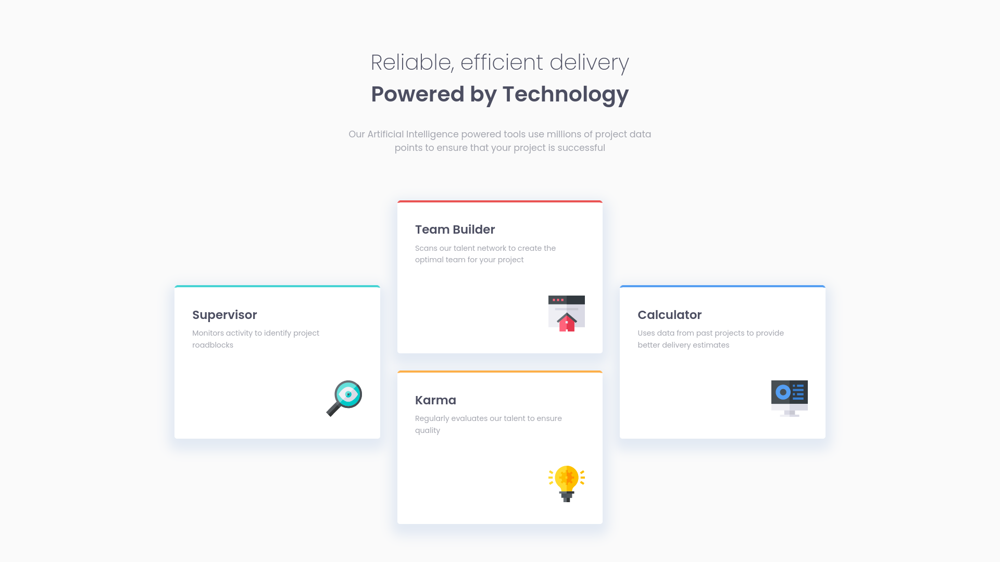
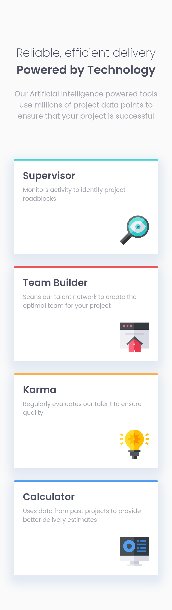

# Frontend Mentor - Four Card Feature Section

This is a solution to the [Four card feature section challenge on Frontend Mentor](https://www.frontendmentor.io/challenges/four-card-feature-section-weK1eFYK). Frontend Mentor challenges help you improve your coding skills by building realistic projects.

## Table of contents

- [Overview](#overview)
  - [The challenge](#the-challenge)
  - [Screenshot](#screenshot)
  - [Links](#links)
  - [Built with](#built-with)
- [Author](#author)

## Overview

### The challenge

**Create a Four card feature section using CSS Grid** where users should be able to:

- View the optimal layout depending on their device's screen size

### Screenshot

Desktop Design Layout

Mobile Design Layout

### Links

- Solution URL: [view]()
- Live Site URL: [visit]()

### Built with

- Semantic HTML5
- CSS Custom Properties
- Grid
- Flex-box
- Mobile-First Approach

## Author

- GitHub - [Kalki2706](https://github.com/Kalki2706/)
- Frontend Mentor - [@Kalki2706](https://www.frontendmentor.io/profile/Kalki2706)
- Twitter - [@Kalki2706](https://www.twitter.com/Kalki2706)
