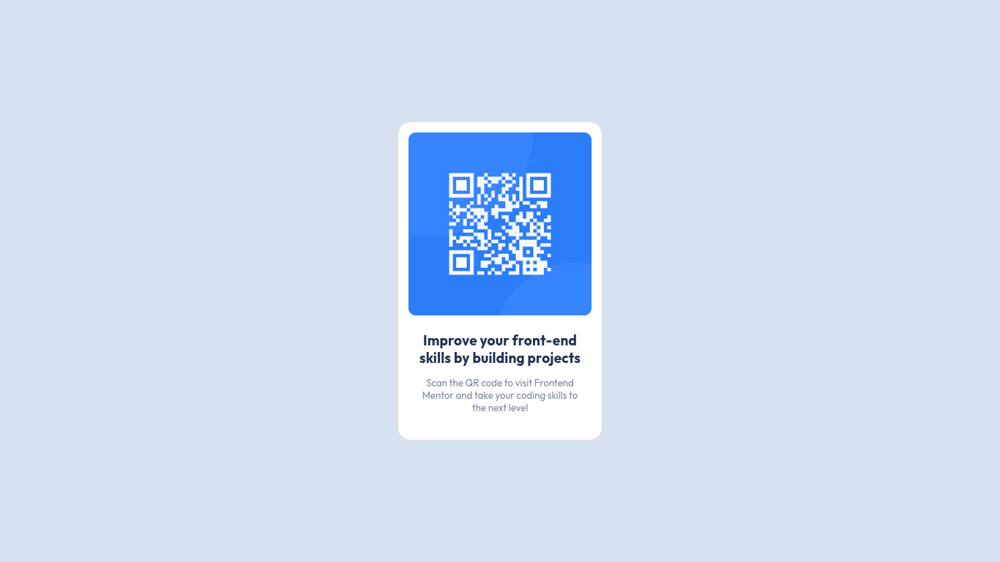

# Frontend Mentor - QR code component :black_heart:

## Links :-

### - Frontend Solution URL : [**Click here**](https://www.frontendmentor.io/solutions/qr-code-component-Gr_52GOmJa)

### - Live Site URL : [**Click here**](https://kalki2706.github.io/frontend-mentor-projects/qr-code-component/index.html)

## Screenshots :-

## Built with :-

- Semantic HTML5 markup
- CSS custom properties
- Mobile-first approach

## What I learned :-

I learned about typography in this project.
